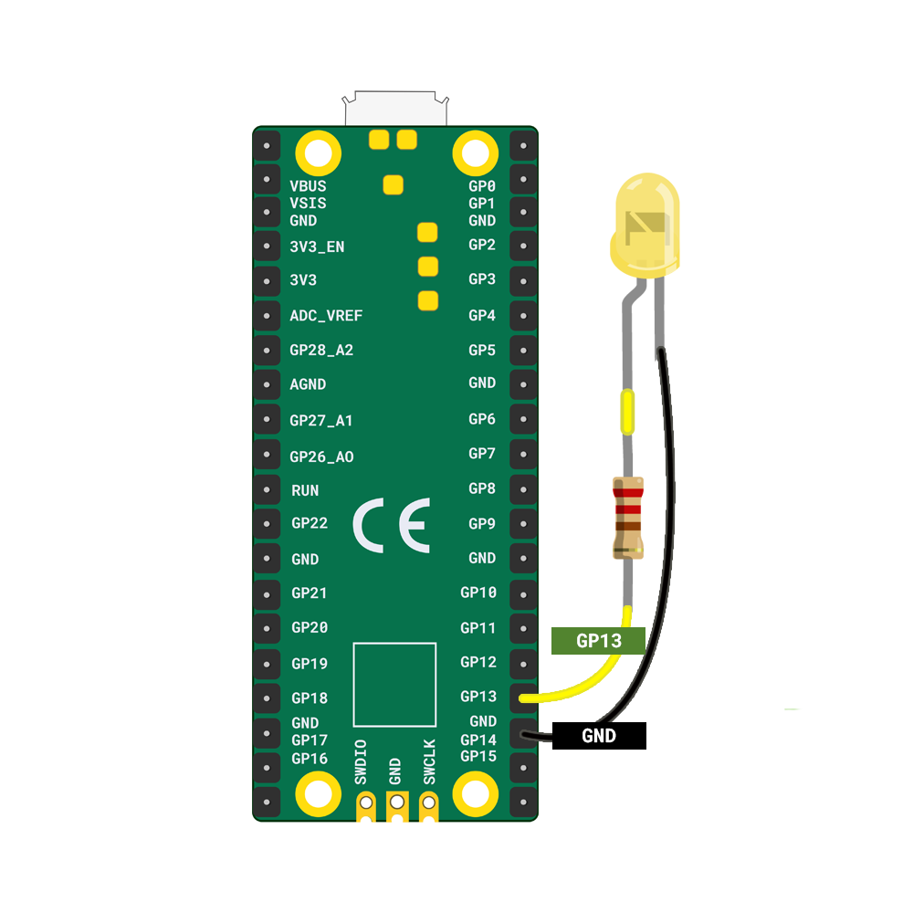

You will need:

+ A Raspberry Pi Pico
+ An LED in your choice of colour
+ A resistor
+ 2 x socket-socket jumper wires

**Note:** The LED should have a resistor attached to the **positive** (long) leg, as well as the two jumper wires.

The diagram below shows how to attach an LED to a Raspberry Pi Pico.

+ Attach the positive leg (the one with the resistor) to **GP13**
+ Attach the negative leg to the closest **GND** pin

