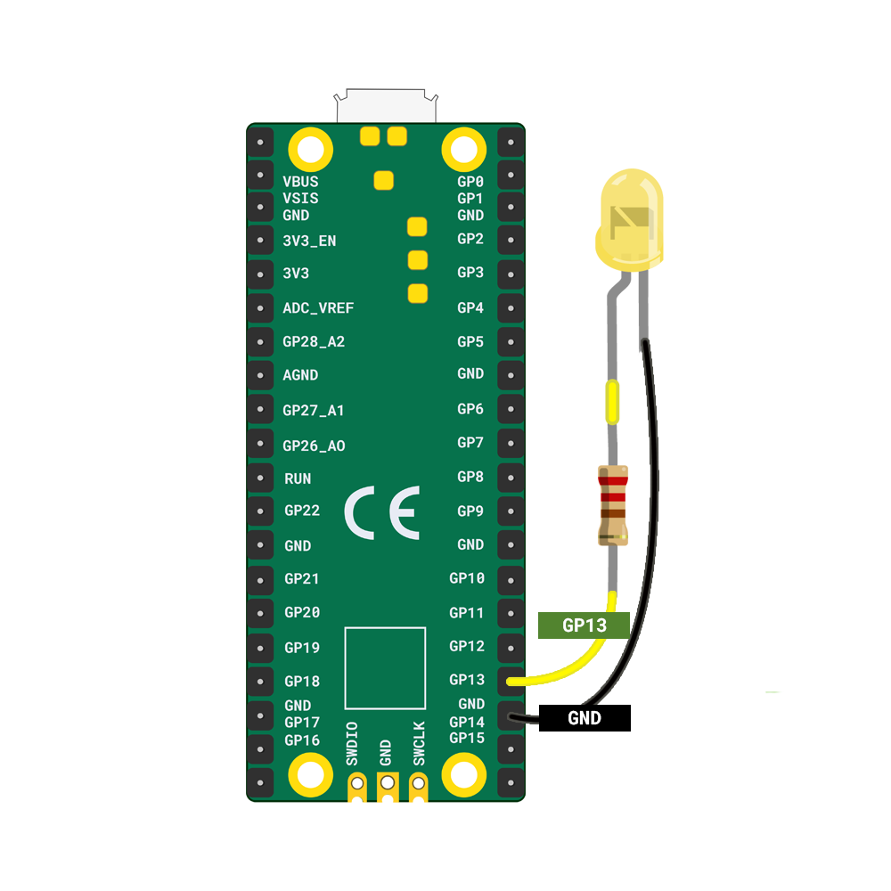

Je hebt nodig:

+ Een Raspberry Pi Pico
+ Een LED in de kleur naar keuze
+ Een weerstand
+ 2 x bus-bus verbindingsdraden

**Let op:** De LED moet een weerstand aangesloten hebben aan de **positieve** (lange) poot, evenals de twee verbindingsdraden.

De afbeelding hieronder toont hoe een LED aan een Raspberry Pi Pico moet worden gekoppeld.

+ Bevestig de positieve poot (die met de weerstand) aan **GP13**
+ Bevestig de negatieve poot aan de dichtstbijzijnde **GND** pin

